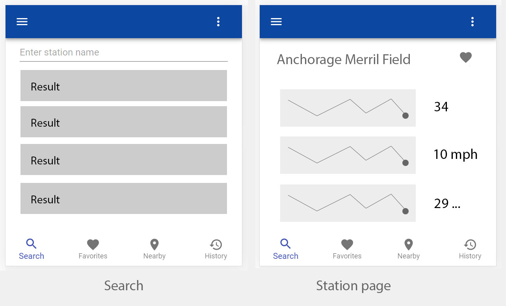

ERDDAP Real Time Web app
========================

A mobile web app that allows users to explore real time sensor data available on an ERDDAP install.  This project was bootstrapped with [Create React App](https://github.com/facebook/create-react-app).


Screenshots and breakdown of intended functionality
---------------------------------------------------


Search

- Simple endless scroll text search that leverages ERDDAP search API
- Station results link in to station page
- Dropdown menu that lists all avaiable variables for filtering on
    - Variable list to come from ERDDAP API




Station page

- Display station name and metadata
    - Metadata retrieved based on station id, using ERDDAP API
- Display time series chart of each avaialble variable for a short time period (default most recent 30 days)
    - Time series data retrieved based on station/variable ids, using ERDDAP API [example observable notebook](https://observablehq.com/@akbstone/test-from-erddap)
- Allow user to mark station as 'favorite'


[SCREENSHOT]


Favorites


History


Getting started
---------------

Requirements

- NPM > 10
- Chrome (https://github.com/facebook/create-react-app/issues/7337)

#### Install it

```
$ git clone
$ npm install
```

#### Run it

```
$ npm start
```

#### Build

```
$ npm run build
```


#### Test

```
$ npm test
```

Customizing
-----------

You can customize several things by setting environment variables.

| Var | Description | Default |
| --- | ----------- | ------- |
| `REACT_APP_ERDDAP_URL` | the base URL that should be used for an ERDDAP instance | `https://erddap.sensors.axds.co` |
| `REACT_APP_LABEL` | the application title | `Real Time ERDDAP App` |
| `REACT_APP_TIME_VAR` | the variable used for the x dimension (time) in plots | `time` |
| `REACT_APP_DEPTH_VAR` | the variable used for the z dimension in plots | `z` |
| `REACT_APP_LOGO` | URL to a logo (unused) | '' |

Defaults are set in [`.env`](.env) and are part of this repository, please leave them be.

To override, create a `.env.local`, or [see the variety of files that can be used](https://create-react-app.dev/docs/adding-custom-environment-variables#what-other-env-files-can-be-used).
Env vars can also be passed when creating a docker instance with the `-e` flag to `docker run`.

Development
-----------

erddap-realtime-app depends on several libraries still being actively developed. The package.json
refers to their github location and will clone those down on install.

- [erddap-parser-js](//github.com/akbstone/erddap-parser-js)
- [erddap-timeseries-chart-js](//github.com/akbstone/erddap-timeseries-chart-js)

If you're actively working on those dependent libraries and you want to have your changes reflected
immediatly, you can use [`npm link`](//docs.npmjs.com/cli/link) to set up symlinks on your development machine.  You will have
to remember to run `npm run build` in the individual projects when making changes in them for 
erddap-realtime-app to reflect the changes.

```
~/dev/erddap-parser-js $ npm link   # may need sudo
~/dev/erddap-parser-js $ cd ~/dev/erddap-realtime-app
~/dev/erddap-realtime-app $ npm link erddap-parser-js
# repeat for erddap-timeseries-chart-js
```

This will replace the node_modules' link to erddap-parser-js with a symlink to your development version
and not make changes to your package.json/package-lock.json.

Docker
------

### Development
If you have Docker installed and running, you can launch the app with docker-compose up -d and then access localhost:3000 to view.

When you're done, run docker-compose down.


### Production
Build the image (recommend using a versioned tag rather than 'latest')
`docker build -f Dockerfile.production -t erddap-realtime-app:latest .`

Run it on port 3000 on your server
`docker run -p 3000:80 erddap-realtime-app`

